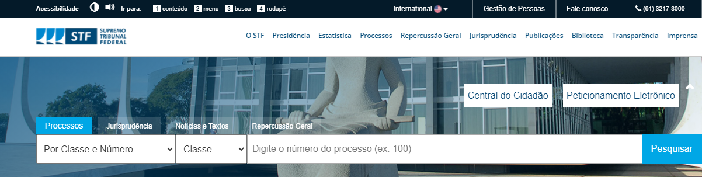
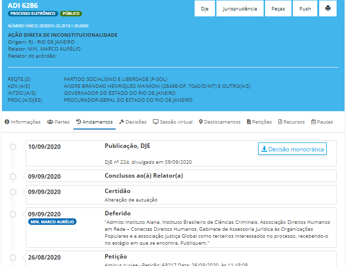
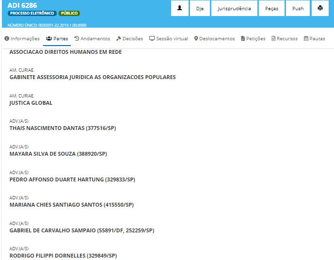
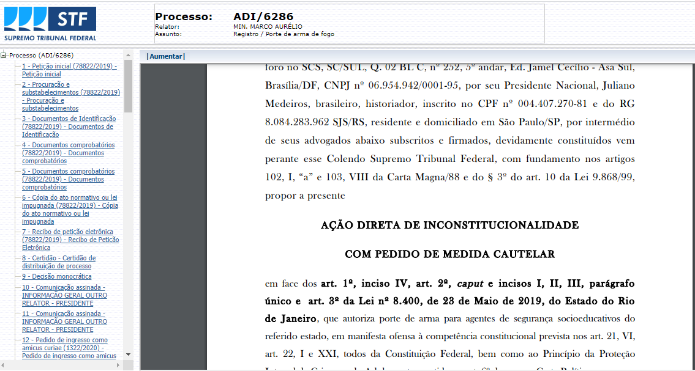
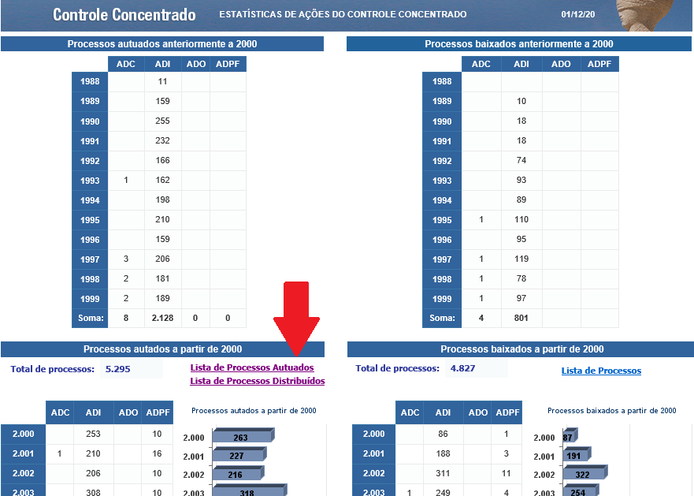
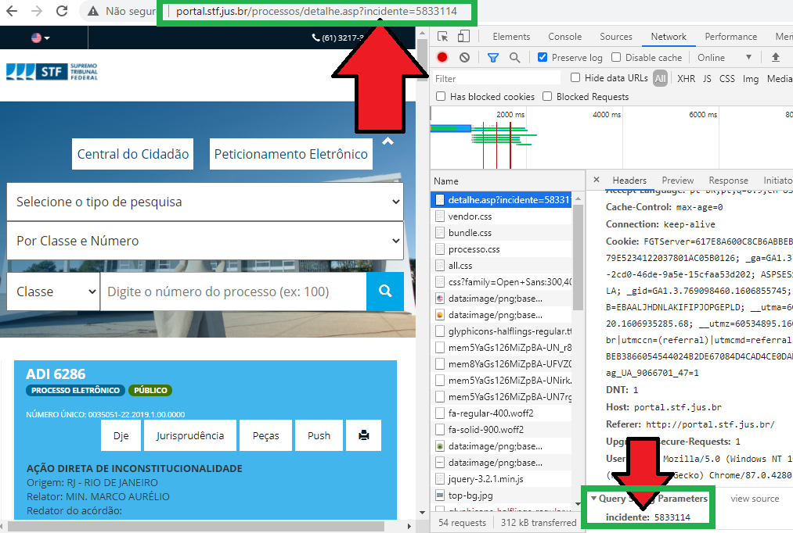
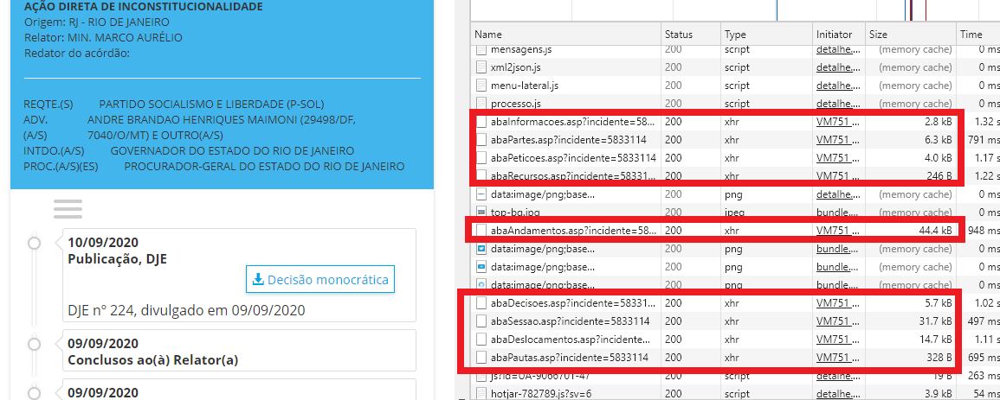
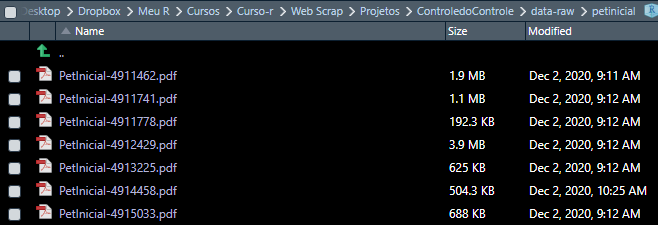

<!-- README.md is generated from README.Rmd. Please edit that file -->

```{r, include = FALSE}
knitr::opts_chunk$set(
  collapse = TRUE,
  comment = "#>"
)
```

# Introdução

No presente projeto vamos apresentar o trabalho final do curso de "Web scraping" da [Curso-R](www.curso-r.com). A ideia foi desenvolver ferramentas para raspar dados do Supremo Tribunal Federal (STF) e fazer algumas análises exploratórias em cima destes.

Espera-se, num futuro, desenvolver pacotes para análises mais profundas, inclusive em outros Tribunais. Os feedbacks são muito bem vindos!

### Delimitação do tema

Vamos aqui nos ater ao [**Supremo Tribunal Federal**](www.stf.jus.br), a Corte cuja atuação (e omissão...) causa o maior impacto social, político e econômico em nossa sociedade.

Mais especificamente, vamos analisar as causas que envolvem diretamente o controle concentrado de constitucionalidade. Isso é, vamos examinar as classes processuais relativas a:

-   [Ação Direta de Inconstitucionalidade (ADI)](https://pt.wikipedia.org/wiki/A%C3%A7%C3%A3o_direta_de_inconstitucionalidade),

-   [Ação Declaratória de Constitucionalidade (ADC)](https://pt.wikipedia.org/wiki/A%C3%A7%C3%A3o_declarat%C3%B3ria_de_constitucionalidade),

-   [Ação Declaratória de Inconstitucionalidade por Omissão (ADO)](https://pt.wikipedia.org/wiki/A%C3%A7%C3%A3o_direta_de_inconstitucionalidade_por_omiss%C3%A3o) e

-   [Arguição de Descumprimento de Preceito Fundamental (ADPF)](https://pt.wikipedia.org/wiki/Argui%C3%A7%C3%A3o_de_descumprimento_de_preceito_fundamental).

Não é apenas por essas classes processuais que a Suprema Corte decide, mas elas representam a atividade mais tradicional e típica de um Tribunal Constitucional em sua concepção clássica. Faz sentido, então, prestigiar e analisar a atuação do STF sob esse aspecto.

Ainda, é possível verificar nessas ações como se dá conflitos relevantes não apenas entre sociedade civil e poder público mas também entre os Poderes Legislativo e Executivo bem como evidencia a (falta de) atuação da Procuradoria-Geral da República.

Durante a pandemia, também, essas ações têm sido especialmente importantes para definição de esferas de responsabilidade (vide ADPF 722), a discussão sobre o plano de vacinação, etc, etc.

A ideia é mapear aspectos como quantidade de ações por tipo/ano, quais os principais litigantes dessas ações (considerando-se os poucos legitimados para tanto), quais os principais temas dessas ações, as palavras-chave mais utilizadas nas petições iniciais, etc.

Com os dados ora obtidos espera-se poder realizar todas essas análises (e várias outras), ainda que a limitação de tempo até a entrega final provavelmente não permita esgotá-las.

### Utilidade e pertinência de *web scraping*

Justifica-se a utilidade tendo-se em vista a importância (crescente?) do STF no cotidiano, não só das pessoas em carreiras jurídicas mas também da academia e das cidadãs e cidadãos comuns.

Trata-se de serviço público (cujo acesso à justiça é, inclusive, previsto na Constituição Federal) que, a despeito de sua importância, ainda é um ilustre desconhecido.

De outro lado, não existe ainda disponibilizados dados abertos desse Tribunal e tampouco existe API que viabilize extração ordenada de dados. Portanto, até o momento, raspar os dados utilizando as técnicas aprendidas no curso é uma opção necessária e viável no presente caso.

Por fim, reitere-se que os processos judiciais são públicos por força do [artigo 93, IX da Constituição Federal](http://www.planalto.gov.br/ccivil_03/constituicao/constituicao.htm#art93ix.), que determina que "*todos os julgamentos do Poder Judiciário serão públicos*".

## Descrição da Página

O portal do STF pode ser acessado pelo seguinte endereço: <http://portal.stf.jus.br/> que dá acesso direto à home. Lá, no topo da página, é possível realizar a consulta por processos:



A ferramenta de consulta é um formulário que permite que se preencha a classe processual escolhida e o número. Na sequência, de forma invisível, o site irá identificar o número de "incidente" e nos redirecionar para a ferramente de busca interna (uma espécie de "API escondida") que nos dará dados como os andamentos e as partes:





Outra das abas possiveis de ser analisada é a de "Peças processuais" que dá efetivo acesso a uma espécie de "pasta virtual" dos procesos, permitindo visualizar documentos, petições e decisões judiciais.



É através dessas páginas, portanto, que pretendemos navegar e extrair dados para as análises futuras.

## Passos do fluxo do web scraping

Vamos explicar brevemente os passos que adotamos para poder realizar a raspagem das ações de controle concentrado. Basicamente, os passos foram:

1.  Lista de ações existentes
2.  Obtenção do número localizador de cada ação (número de incidente)
3.  Raspagem dos dados de parte
4.  Raspagem dos andamentos
5.  Acessar "pasta virtual" do caso
6.  Localizar a petição inicial
7.  Baixar o arquivo .pdf

Falaremos a seguir mais detalhadamente cada uma delas.

### *1. Identificar a lista de ações atualmente existentes*

O primeiro passo foi localizar uma lista de processos das classes escolhidas (ADPF, ADC, ADO e ADI) que sejam efetivamente existentes. Uma informação importante é que os números das ações no STF são sequenciais, por força de seu regimento.

Isso quer dizer que as ações propostas receberão um número de acordo com a ordem de sua propositura: a primeira ação de uma classe (uma ADI, por exemplo) será número 1, a segunda número 2 e assim sucessivamente.

Seria possível, então, iniciar a busca pela primeira ação de cada uma das classes e iterar indefinidamente até localizar as mais recentes.

Contudo, aproveitou-se o fato de que o Tribunal possui um painel de estatística que contem um link para uma tabela em formado .xlsx contendo todos os casos distribuídos ou autuados desde 2000.

Optou-se por utilizar a tabela de casos *autuados* pois a distribuição é uma fase posterior, que pode levar alguns dias para ocorrer ou, mesmo, sequer acontecer.



Verificou-se que esse [link era estático](http://www.stf.jus.br/arquivo/cms/publicacaoBOInternet/anexo/estatistica/ControleConcentradoGeral/Lista_Autuados.xlsx) e, portanto, não seria necessário atualizá-lo com frequência. Assim, foi criada uma função que baixa diariamente esse arquivo.

### *2. Localizar o "incidente"*

A tabela de casos disponibilizada pelo Tribunal, embora útil, não contém todas as informações que são desejáveis para uma análise mais aprofundada. Por isso, não basta saber "quais" são os números das ações: é preciso também localizar o código de incidente, que nos leva até a página que efetivamente contém os dados.



Como esse é um número interno do sistema e, portanto, absolutamente arbitrário, é preciso descobri-lo caso a caso.

A melhor forma de fazer isso foi simular uma requisição da seguinte forma, criando uma função que recebe como parâmetros a classe e o número do processo:

```{r exemplo-get-incidente, eval=FALSE, message=FALSE, warning=FALSE, include=FALSE, paged.print=FALSE}

# url da página
  u_stf_listar <- "http://portal.stf.jus.br/processos/listarProcessos.asp"

# query que busca classe e numero
  q_stf_listar <- list("classe" = classe,
                       "numeroProcesso" = numero)

# requisição
  r_stf_listar <- httr::GET(u_stf_listar,
                            query = q_stf_listar)
```

Realizando essa requisição, sou redirecionado para a página com os dados do processo, cujo url conterá o número de incidente. Assim, extraio esse número da resposta:

```{r exemplo-regex-incidente, eval = FALSE, message = FALSE, warning = FALSE, include = FALSE}
 r_stf_listar$url %>%
         stringr::str_extract("(?<=\\?incidente\\=)[0-9]+$")
```

Iterando isso para cada um dos processos que desejo, salvo o resultado numa tabela auxiliar, salva em .rds para uso futuro:

```{r exemplo-tbl-incidente, echo=FALSE, message=FALSE, warning=FALSE, paged.print=FALSE}

head(readr::read_rds("data/BaseIncidentes.rds"))
```

### *3. Obtenção dos dados do processo*

Obtido o número de incidente, posso simular uma requisição para obter informações.

Observando mais atendamente as requisições, porém, observo que o site abre uma série de páginas menores que fazem referência ao número do incidente.



Essas páginas, do tipo XHR, se mostraram muito mais simples de serem salvas localmente e raspadas. Por isso, foram elas as utilizadas para criar uma função denominada `baixar_dados_processo` que recebe o incidente, busca as abas de meu interesse (nesse caso, as relativas a partes e andamentos) e as salva em disco caso já não existam.

### *4. Raspagem dos dados de parte*

Após salvar em disco o resultado da requisição para a aba relativa às partes, foi criada a função `ler_aba_partes` que, recebendo o número do incidente, localiza o arquivo adequado e realiza a leitura.

Como os dados são bem estruturados no arquivo html, conseguimos montar uma tabela contendo a natureza de cada uma das partes (requerente, requerida/o, interessada/o, *amicus curiae*) e seus respectivos representantes.

```{r exemplo-ler-partes, echo=FALSE, paged.print=FALSE}
source("R/3-pegar_dados.R")
ler_aba_partes(incidente = "5833114")
```

### *5. Raspagem dos dados de parte*

Procedimento semelhante é feito para os andamentos. Foi criada a função `ler_aba_andamento` que, recebendo o número do incidente, irá buscar o arquivo já salvo em disco.

Será lida a data e o nome de cada andamento e montada uma tabela estruturada com essas informações, sempre indexidadas com o número do incidente:

```{r exemplo-ler-andamentos, echo=FALSE, paged.print=TRUE}
ler_aba_andamento(incidente = "5833114")

```

### *6. Localizar a "pasta virtual" do caso*

Há uma aba específica com as peças processuais disponíveis ao público. Ela leva a uma outra página, como vimos, acima, onde os documentos listados se encontram.

O formato dessa página é bem mais complexo que as demais, porém felizmente ela também é acessível por meio do incidente.

Ela possui um painel de navegação contendo links para todos os documentos que, ao clicar, fazem com que seja aberto na página ao lado.

### *7. Identificar a petição inicial*

Uma vez aberta a pasta virtual podemos extrair todos os documentos disponíveis por lá. Contudo, para esse projeto definimos extrair somente a petição inicial que é a peça processual que define o objeto da causa.

Como o nome já diz, ela que inicia o processo e, portanto, é esperado que seja um dos primeiros documentos linkados. Verificamos no código fonte que todos os links de documentos continham texto explicativo do que se tratava e todos fazem referência a uma função javascript (que deve ter relação com a visualização do documento).

Assim, foi necessário localizar os hyperlinks e, dentre esses, os que fazem menção expressa a "petição inicial". Por segurança, caso nenhum documento seja localizado, iremos buscar o primeiro documento listado.

Localizado o link, capturamos a que página ele se redireciona e, assim, obtemos o link para a petição em si.

### *8. Dowload e leitura da petição inicial*

Foi criada a função `baixar_pet_inicial` que, recebendo o número do incidente, faz as etapas descritas acima e salva em disco o arquivo .pdf.



Da mesma maneira, a função `ler_pdf_inicial`busca a petição já baixada relativa ao incidente indicado e faz a leitura da mesma, retornando uma string com seu conteúdo.

```{r exemplo-ler-pdf, echo=FALSE}
source("R/5-ler_pdf.R", echo = FALSE, verbose = FALSE)
ler_pdf_inicial("5833114")

```

## Produtos da raspagem

## algumas análises feitas

## próximos passos

### sugestões de análises

### sugestões de pacote a ser feito

painel de análise das ações de controle concentrado assuntos mais frequentes autores rodar no git hub actions
