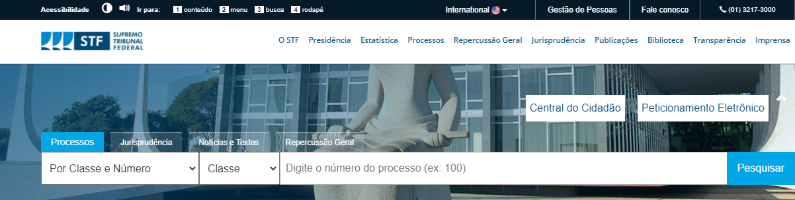
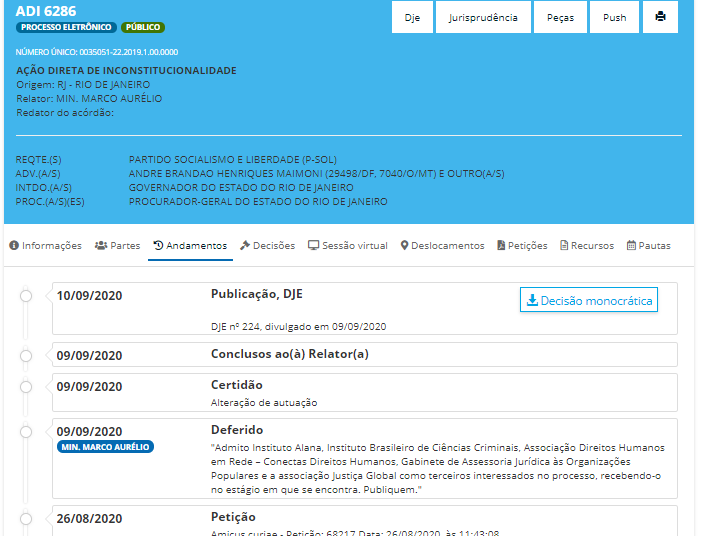
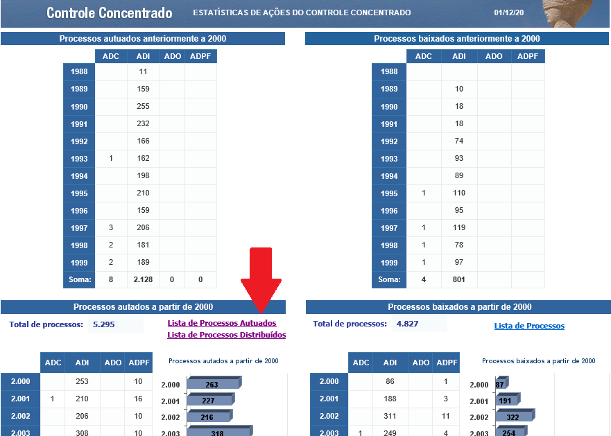
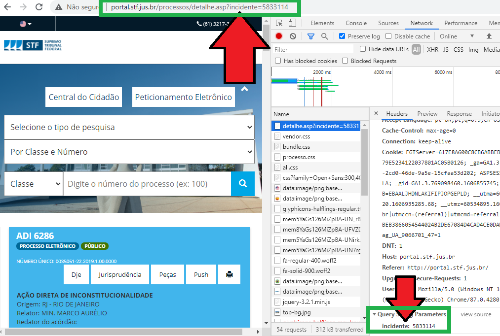
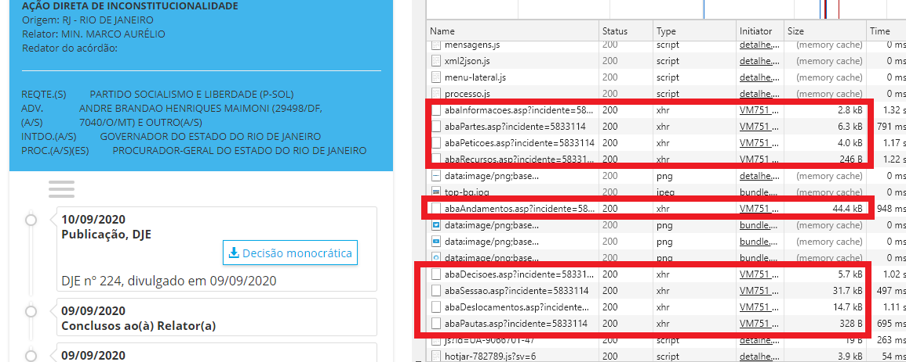
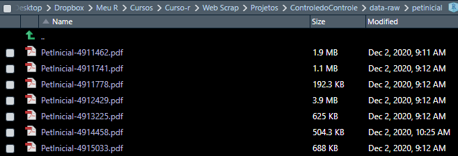
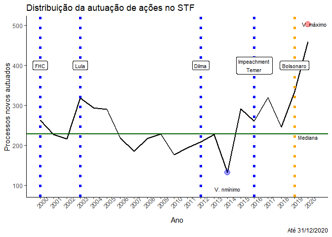
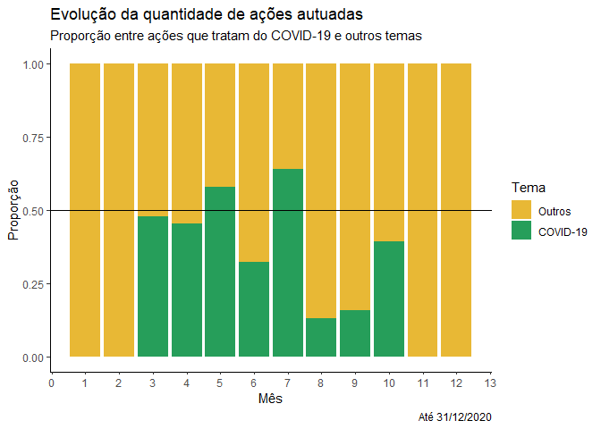
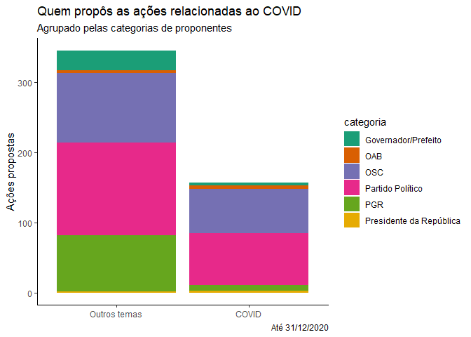

<!-- README.md is generated from README.Rmd. Please edit that file -->

# Introdução

No presente projeto vou apresentar o trabalho final do curso de “Web
scraping” da [Curso-R](www.curso-r.com). A ideia foi desenvolver
ferramentas para raspar dados do Supremo Tribunal Federal (STF) e fazer
algumas análises exploratórias preliminares e incipientes em cima destes
dados. Espera-se, num futuro, desenvolver pacotes para análises mais
profundas, inclusive em outros Tribunais.

Os feedbacks são **muito** bem vindos\!

### Delimitação do tema

Vou aqui me ater ao [**Supremo Tribunal Federal**](www.stf.jus.br), a
Corte cuja atuação (e omissão…) causa o maior impacto social, político e
econômico em nossa sociedade.

Mais especificamente, analisar as causas que envolvem diretamente o
**controle concentrado de constitucionalidade**. Isso é, examinaremos as
classes processuais relativas a:

  - [Ação Direta de Inconstitucionalidade
    (ADI)](https://pt.wikipedia.org/wiki/A%C3%A7%C3%A3o_direta_de_inconstitucionalidade),
  - [Ação Declaratória de Constitucionalidade
    (ADC)](https://pt.wikipedia.org/wiki/A%C3%A7%C3%A3o_declarat%C3%B3ria_de_constitucionalidade),
  - [Ação Declaratória de Inconstitucionalidade por Omissão
    (ADO)](https://pt.wikipedia.org/wiki/A%C3%A7%C3%A3o_direta_de_inconstitucionalidade_por_omiss%C3%A3o)
    e
  - [Arguição de Descumprimento de Preceito Fundamental
    (ADPF)](https://pt.wikipedia.org/wiki/Argui%C3%A7%C3%A3o_de_descumprimento_de_preceito_fundamental).

Essas classes processuais representam a atividade mais tradicional e
típica de um Tribunal Constitucional em sua concepção clássica. Faz
sentido, então, prestigiar e analisar a atuação do STF sob esse aspecto.
(Não se ignore que o Supremo Tribunal Federal brasileiro tem
competências que vão muito além disso, mas isso é papo para outro
projeto…).

Ainda, é possível verificar nessas ações como se dão **conflitos
relevantes** não apenas entre sociedade civil e poder público mas também
entre os Poderes Legislativo e Executivo bem como evidencia a atuação da
Procuradoria-Geral da República.

Durante a **pandemia**, também, essas ações têm sido especialmente
importantes para definição de esferas de responsabilidade (vide ADPF
722), a discussão sobre o plano de vacinação, etc, etc.

A ideia é mapear aspectos como quantidade de ações por tipo/ano, quais
os principais litigantes dessas ações (considerando-se os poucos
legitimados para tanto), quais os principais temas dessas ações, as
palavras-chave mais utilizadas nas petições iniciais, etc.

Com os dados ora obtidos espera-se poder realizar todas essas análises
(e várias outras), ainda que a limitação de tempo até a entrega final
provavelmente não permita esgotá-las.

### Utilidade e pertinência de *web scraping*

Justifica-se a utilidade tendo-se em vista a importância (*crescente?*)
do STF no cotidiano, não só das pessoas em carreiras jurídicas mas
também da academia e das cidadãs e cidadãos comuns.

Trata-se de serviço público (cujo acesso à justiça é, inclusive,
previsto na Constituição Federal) que, a despeito de sua importância,
ainda é um *ilustre desconhecido*…

(E, sabemos, o juridiquês em nada ajuda: torço para que por meio da
ciência de dados seja possível melhor compreender e melhor explicar o
que faz o STF.)

De outro lado, não existe ainda disponibilizados dados abertos desse
Tribunal e tampouco existe API pública e documentada que viabilize
extração ordenada de dados. Portanto, até o momento, raspar os dados
utilizando as técnicas aprendidas no curso é uma opção necessária e
viável no presente caso.

Por fim, reitere-se que os processos judiciais são públicos por força do
[artigo 93, IX da Constituição
Federal](http://www.planalto.gov.br/ccivil_03/constituicao/constituicao.htm#art93ix.),
que determina que “*todos os julgamentos do Poder Judiciário serão
públicos*”. Também, tomei o cuidado de fazer as requisições mais
volumosas durante a madrugada a fim de não onerar o servidor: seria uma
triste ironia ser processado por sobrecarregar o Tribunal…

## Descrição da Página

O portal do STF pode ser acessado pelo seguinte endereço:
<http://portal.stf.jus.br/> que dá acesso direto à home. Lá, no topo da
página, é possível realizar a consulta por processos:

A ferramenta de consulta é um formulário que permite que se preencha a
**classe processual** escolhida e o **número**. Na sequência, *de forma
invisível*, o site irá identificar o número de “incidente” e nos
redirecionar para a ferramente de busca interna (uma espécie de “API
escondida”) que nos dará dados como os andamentos e as partes:

Outra das abas possiveis de ser analisada é a de “Peças processuais” que
dá efetivo acesso a uma espécie de “pasta virtual” dos procesos,
permitindo visualizar documentos, petições e decisões judiciais.

(*Quem teve o desprazer de manusear os autos de processos físicos ao ver
hoje o processo virtual ser uma realidade chega a dar um suspiro de
alívio*)

É através dessas páginas, portanto, que poderemos navegar e extrair
dados para as análises futuras.

## Passos do fluxo do web scraping

Vou explicar brevemente os passos que adotei para poder realizar a
raspagem das ações de controle concentrado. Basicamente, foram:

1.  Lista de ações existentes
2.  Obtenção do número localizador de cada ação (número de incidente)
3.  Raspagem dos dados de parte
4.  Raspagem dos andamentos
5.  Acessar “pasta virtual” do caso
6.  Localizar a petição inicial
7.  Baixar o arquivo .pdf

a seguir mais detalhadamente cada uma delas.

### *1. Identificar a lista de ações atualmente existentes*

O primeiro passo foi localizar uma **lista de processos das classes
escolhidas** (ADPF, ADC, ADO e ADI) que sejam efetivamente existentes.
Uma informação importante é que os números das ações no STF são
sequenciais, por força de seu regimento.

Isso quer dizer que as ações propostas receberão um número *de acordo
com a ordem de sua propositura*: a primeira ação de uma classe (uma ADI,
por exemplo) será número 1, a segunda número 2 e assim sucessivamente.

Seria possível, então, iniciar a busca pela primeira ação de cada uma
das classes e iterar indefinidamente até localizar as mais recentes.

Contudo, aproveitou-se o fato de que o Tribunal possui um painel de
estatística que contem um link para uma tabela em formado `.xlsx`
contendo todos os casos distribuídos ou autuados desde 2000.

Optou-se por utilizar a tabela de casos *autuados* pois a distribuição é
uma fase posterior, que pode levar alguns dias para ocorrer ou, mesmo,
sequer acontecer.

Verificou-se que esse [link era
estático](http://www.stf.jus.br/arquivo/cms/publicacaoBOInternet/anexo/estatistica/ControleConcentradoGeral/Lista_Autuados.xlsx)
e, portanto, não seria necessário atualizá-lo com frequência. Assim, foi
criada uma função que baixa diretamente esse arquivo.

### *2. Localizar o “incidente”*

A tabela de casos disponibilizada pelo Tribunal, embora útil, não contém
todas as informações que são desejáveis para uma análise mais
aprofundada.

Por isso, não basta saber “quais” são os números das ações: é preciso
também localizar o **código de incidente**, que nos leva até a página
que efetivamente contém os dados.

Como esse é um número interno do sistema e, portanto, absolutamente
arbitrário, é preciso descobri-lo caso a caso.

A melhor forma de fazer isso foi simular uma requisição da seguinte
forma, criando uma função que recebe como parâmetros a classe e o número
do processo:

Realizando essa requisição, sou redirecionado para a página com os dados
do processo, cujo url conterá o número de incidente. Assim, extraio esse
número da resposta:

Iterando isso para cada um dos processos que desejo, salvo o resultado
numa tabela auxiliar, salva em .rds para uso futuro:

    #> # A tibble: 6 x 3
    #>   classe numero incidente
    #>   <chr>   <dbl> <chr>    
    #> 1 ADC        53 5436051  
    #> 2 ADC        54 5440576  
    #> 3 ADC        55 5471945  
    #> 4 ADC        56 5472003  
    #> 5 ADC        57 5511026  
    #> 6 ADC        58 5526245

### *3. Obtenção dos dados do processo*

Obtido o número de incidente, posso simular uma requisição para obter
informações.

Observando mais atentamente as requisições, porém, observo que o site
abre uma série de páginas menores que fazem também referência ao número
do incidente.

Essas páginas, do tipo XHR, se mostraram muito mais simples de serem
salvas localmente e raspadas. Por isso, foram elas as utilizadas para
criar uma função denominada `baixar_dados_processo` que recebe o
incidente, busca as abas de meu interesse (nesse caso, as relativas a
partes e andamentos) e as salva em disco caso já não existam.

### *4. Raspagem dos dados de parte*

Após salvar em disco o resultado da requisição para a aba relativa às
partes, foi criada a função `ler_aba_partes` que, recebendo o número do
incidente, localiza o arquivo adequado e realiza a leitura.

Como os dados são bem estruturados no arquivo `html`, conseguimos montar
uma tabela contendo a natureza de cada uma das partes (requerente,
requerida/o, interessada/o, *amicus curiae*) e seus respectivos
representantes.

    #> # A tibble: 22 x 3
    #>    incidente tipo  nome                                                         
    #>    <chr>     <chr> <chr>                                                        
    #>  1 5833114   REQTE PARTIDO SOCIALISMO E LIBERDADE (P-SOL)                       
    #>  2 5833114   ADV   ANDRE BRANDAO HENRIQUES MAIMONI (29498/DF, 7040/O/MT) E OUTR~
    #>  3 5833114   INTDO GOVERNADOR DO ESTADO DO RIO DE JANEIRO                       
    #>  4 5833114   PROC  PROCURADOR-GERAL DO ESTADO DO RIO DE JANEIRO                 
    #>  5 5833114   INTDO ASSEMBLEIA LEGISLATIVA DO ESTADO DO RIO DE JANEIRO           
    #>  6 5833114   ADV   SEM REPRESENTAÇÃO NOS AUTOS                                  
    #>  7 5833114   INTDO SINDICATO DOS SERVIDORES DA CARREIRA SOCIOEDUCATIVA DO ESTAD~
    #>  8 5833114   ADV   RENATA MAIA SERRA (137788/RJ)                                
    #>  9 5833114   ADV   NATALIE AFONSO TOLEDO (196254/RJ)                            
    #> 10 5833114   AM    DEFENSORIA PÚBLICA DO ESTADO DO RIO DE JANEIRO               
    #> # ... with 12 more rows

### *5. Raspagem dos dados de parte*

Procedimento semelhante é feito para os andamentos. Foi criada a função
`ler_aba_andamento` que, recebendo o número do incidente, irá buscar o
arquivo já salvo em disco.

Será lida a data e o nome de cada andamento e montada uma tabela
estruturada com essas informações, sempre indexidadas com o número do
incidente:

    #> # A tibble: 36 x 3
    #>    incidente data       andamento                 
    #>    <chr>     <date>     <chr>                     
    #>  1 5833114   2020-09-10 Publicação, DJE           
    #>  2 5833114   2020-09-09 Conclusos ao(à) Relator(a)
    #>  3 5833114   2020-09-09 Certidão                  
    #>  4 5833114   2020-09-09 Deferido                  
    #>  5 5833114   2020-08-26 Petição                   
    #>  6 5833114   2020-07-28 Publicação, DJE           
    #>  7 5833114   2020-07-24 Conclusos ao(à) Relator(a)
    #>  8 5833114   2020-07-24 Certidão                  
    #>  9 5833114   2020-07-24 Deferido                  
    #> 10 5833114   2020-07-17 Conclusos ao(à) Relator(a)
    #> # ... with 26 more rows

### *6. Localizar a “pasta virtual” do caso*

Há uma aba específica com as peças processuais disponíveis ao público.
Ela leva a uma outra página, como vimos, acima, onde os documentos
listados se encontram.

O formato dessa página é bem mais complexo que as demais, porém
felizmente ela também é acessível por meio do incidente.

Ela possui um painel de navegação contendo links para todos os
documentos que, ao clicar, fazem com que seja aberto na página ao lado.

### *7. Identificar a petição inicial*

Uma vez aberta a pasta virtual podemos extrair todos os documentos
disponíveis por lá. Contudo, para esse projeto *vamos extrair somente a
petição inicial* que é a peça processual que define o objeto da causa.

Como o nome já diz, ela que inicia o processo e, portanto, é esperado
que seja um dos primeiros documentos linkados. Verificamos no código
fonte que todos os links de documentos continham texto explicativo do
que se tratava e todos fazem referência a uma função `javascript`(que
deve ter relação com a visualização do documento).

Assim, foi necessário localizar os *hyperlinks* e, dentre esses, os que
fazem menção expressa a “petição inicial”. Por segurança, caso nenhum
documento seja localizado, iremos buscar o primeiro documento listado
(afinal, é razoável supor que a inicial é a primeira das peças).

Localizado o link, capturamos a que página ele se redireciona e, assim,
obtemos o link para a petição em si.

### *8. Dowload e leitura da petição inicial*

Foi criada a função `baixar_pet_inicial` que, recebendo o número do
incidente, faz as etapas descritas acima e salva em disco o arquivo
.pdf.

Da mesma maneira, a função `ler_pdf_inicial`busca a petição já baixada
relativa ao incidente indicado e faz a leitura da mesma, retornando uma
string com seu conteúdo.

    #> Joining, by = "word"
    #> # A tibble: 1 x 2
    #>   incidente texto_inicial                                                       
    #>   <chr>     <chr>                                                               
    #> 1 5833114   Assinado de forma digital ANDRE BRANDAO por ANDRE BRANDAO HENRIQUES~

## Produtos da raspagem

Para os fins desse traballho, foram selecionadas todas as ações autuadas
**entre 2016 e 2020** (até 01/12/2020, mais especificamente). Foram
salvos dados sobre as ações em si (direto do STF), os respectivos
números de incidente, as partes, os andamentos, e a petição inicial.

Na pasta `/data` foram salvos arquivos .rds contendo esses dados. São os
seguintes:

### *a) Base de incidentes*

É a tabela que salva a correspondência entre classe e número
(informações conhecidas) com a do incidente (informação desconhecida).

    #> # A tibble: 6 x 3
    #>   classe numero incidente
    #>   <chr>   <dbl> <chr>    
    #> 1 ADC        53 5436051  
    #> 2 ADC        54 5440576  
    #> 3 ADC        55 5471945  
    #> 4 ADC        56 5472003  
    #> 5 ADC        57 5511026  
    #> 6 ADC        58 5526245

| Coluna      | Descrição                                                  |
| ----------- | ---------------------------------------------------------- |
| *classe*    | Classe processual (ADI, ADC, ADO ou ADPF)                  |
| *numero*    | Número sequencial daquele processo                         |
| *incidente* | Localizador numérico do processo no sistema interno do STF |

### *b) Base de partes*

Relaciona as partes para todos os processos da base.

Ela está em um formato em que o número do incidente é repetido para cada
linha. A ideia é que seja possível filtrar, agrupar, pivotar e realizar
join de acordo com a necessidade de cada análise.

    #> # A tibble: 6 x 3
    #>   incidente tipo  nome                                                    
    #>   <chr>     <chr> <chr>                                                   
    #> 1 5436051   REQTE DIRETÓRIO NACIONAL DO PROGRESSISTAS-PP                  
    #> 2 5436051   ADV   LISE REIS BATISTA DE ALBUQUERQUE (25998/DF) E OUTRO(A/S)
    #> 3 5436051   INTDO PRESIDENTE DA REPÚBLICA                                 
    #> 4 5436051   PROC  ADVOGADO-GERAL DA UNIÃO                                 
    #> 5 5436051   INTDO CONGRESSO NACIONAL                                      
    #> 6 5436051   PROC  ADVOGADO-GERAL DA UNIÃO

| Coluna      | Descrição                                                                                         |
| ----------- | ------------------------------------------------------------------------------------------------- |
| *incidente* | Localizador numérico do processo no sistema interno do STF                                        |
| *tipo*      | Que qualidade a parte ocupa no processo (ex. requerente, requerida, advogada, amicus curiar, etc) |
| *nome*      | Nome da parte                                                                                     |

### *c) Base de andamentos*

Relaciona os andamentos para todos os processos da base.

Assim como a anterior, está em um formato em que o número do incidente é
repetido para cada linha. A ideia é que seja possível filtrar, agrupar,
pivotar e realizar join de acordo com a necessidade de cada análise.

    #> # A tibble: 6 x 3
    #>   incidente data       andamento                       
    #>   <chr>     <date>     <chr>                           
    #> 1 5436051   2018-09-11 Baixa ao arquivo do STF, Guia nº
    #> 2 5436051   2018-09-11 Transitado(a) em julgado        
    #> 3 5436051   2018-08-14 Publicação, DJE                 
    #> 4 5436051   2018-08-10 Extinto o processo              
    #> 5 5436051   2018-04-12 Conclusos ao(à) Relator(a)      
    #> 6 5436051   2018-04-12 Distribuído

| Coluna      | Descrição                                                  |
| ----------- | ---------------------------------------------------------- |
| *incidente* | Localizador numérico do processo no sistema interno do STF |
| *data*      | Data em que ocorreu o andamento                            |
| *nome*      | Andamento em si                                            |

### *d) Base de andamentos*

Relaciona o inteiro teor das petições para todos os processos da base.

Assim como a anterior, está em um formato em que o número do incidente é
repetido para cada linha. A ideia é qie seja possível filtrar, agrupar,
pivotar e realizar join de acordo com a necessidade de cada análise.

Por ser um texto extenso, é a única que está compactada. Ela também foi
pré-processada com o pacote `{pdftools}` para que fosse colapsada em
apenas uma única grande string.

    #> # A tibble: 6 x 2
    #>   incidente texto_inicial                                                       
    #>   <chr>     <chr>                                                               
    #> 1 6012085   "SÉRGIO VICTOR ADVOCACIA EXCELENTÍSSIMO SENHOR MINISTRO LUIZ FUX PR~
    #> 2 6025884   "EXCELENTÍSSIMO(A) SENHOR(A) MINISTRO PRESIDENTE DO SUPREMO TRIBUNA~
    #> 3 5337403   "EXCELENTÍSSIMA SENHORA MINISTRA PRESIDENTE DO EGRÉGIO SUPREMO TRIB~
    #> 4 5340474   "EXCELENTÍSSIMA SENHORA MINISTRA CÁRMEN LÚCIA, PRESIDENTE DO SUPREM~
    #> 5 5341021   ""                                                                  
    #> 6 5341622   "EXCELENTÍSSIMA SENHORA PRESIDENTE DO EGRÉGIO SUPREMO TRIBUNAL FEDE~

| Coluna           | Descrição                                                  |
| ---------------- | ---------------------------------------------------------- |
| *incidente*      | Localizador numérico do processo no sistema interno do STF |
| *texto\_inicial* | String colapsada contendo todo o teor da petição inicial   |

### *e) Base de palavras-chave*

Não extraída diretamente do STF, mas decorrente de um pré-processamento
do texto da petição inicial, ela relaciona as 10 palavras mais
frequentes em cada petição inicial.

É uma primeira experiência para futura aplicação de técnicas de
modelagem de texto. Ainda está sujeita a *muitas* melhorias e serve, por
enquanto, apenas enquanto protótipo.

    #> # A tibble: 6 x 2
    #> # Rowwise: 
    #>   incidente palavra                                                             
    #>   <chr>     <chr>                                                               
    #> 1 6012085   "trabalho, periculosidade, cep, adicional, superior, sao, litros, n~
    #> 2 6025884   "nº, cidadao, constitucional, constituicao, artigo, constitucionali~
    #> 3 5337403   "transporte, nº, combustiveis, º, estadual, sobre, nacional, uniao,~
    #> 4 5340474   "procurador, º, anexo, nº, ii, i, cargo, geral, estado, parte"      
    #> 5 5341021   ""                                                                  
    #> 6 5341622   "nº, bens, direito, divida, º, ativa, constitucional, ii, fazenda, ~

| Coluna      | Descrição                                                  |
| ----------- | ---------------------------------------------------------- |
| *incidente* | Localizador numérico do processo no sistema interno do STF |
| *palavra*   | Lista das 10 palavras mais frequentes no documento         |

# Algumas Análises

Sem qualquer pretensão de esgotar o tema, faremos aqui algumas poucas
análises exploratórias apenas para ilustrar o potencial do tema e
mostrar a beleza que é o mundo jurídico (especialmente quando a ele se
olha pela lente dos dados).

## Distribuição das ações ao longo dos últimos anos

O primeiro aspecto que podemos observar é a **quantidade** de ações de
controle concentrado de constitucionalidade ao longo dos anos. Abaixo,
sem fazer distinção de qual categoria, vamos ver como se deu essa
distribuição:

<!-- -->

Aqui não estamos preocupados com o “saldo” de ações, ou seja, o gráfico
acima *não é afetado pela produtividade do Tribunal* mas indica **como
variou** a “procura” pela sua tutela constitucional ao longo do período.

E chama muito a atenção a **tendência acentuada no aumento ao longo dos
últimos anos**, em especial a partir de 2019. Uma hipótese para esse
aumento é o cenário de *crise institucional* presente no país desde a
eleição do atual Presidente da República.

Como já noticiado, é uma característica de seu governo o excesso de
Decretos editados, muitas vezes indo além dos limites legais. [Já
noticiou o
UOL](https://noticias.uol.com.br/ultimas-noticias/agencia-estado/2019/05/18/30-medidas-do-governo-ja-sao-alvo-de-acoes-no-stf.htm)
que, antes de terminado o primeiro semestre de 2019, já havia mais de 30
medidas questionadas no STF. Alguns veículos, [como o
Estadão](https://politica.estadao.com.br/noticias/geral,sem-articulacao-oposicao-investe-em-acoes-no-stf-contra-bolsonaro,70003019596),
apontam uma espécie de estratégia da oposição de ir mais frequentemente
ao Supremo contra atos da Presidência, sobretudo face um estado de
tensão entre os Poderes.

Outra explicação, agravada pelo contexto acima descrito, é a **pandemia
de COVID-19** que enfrentamos nesse momento. Veja-se que, mesmo antes de
encerrado o ano de 2020, esse ano já é recordista em ações
constitucionais propostas,

## Evolução nas classes processuais

Um outro aspecto interessante é observar *quais* os instrumentos vêm
sendo mais utilizados dentre os 4 normalmente disponíveis no âmbito do
controle de constitucionalidade.

Veremos abaixo a evolução de cada uma das classes ao longo dos últimos
anos:

<!-- -->

Percebe-se, naturalmente, uma prevalência da ADI, que se mantem
constante, bem como uma baixa utilização da ADC e da ADO, que foram
melhor regulamentadas ao longo do início dos anos 2000. Chama a atenção,
contudo, como evoluiu - sobretudo nos últimos anos - a utilização da
ADPF.

Isso é curioso justamente por ser uma característica dessa ação a
subsidiariedade. Ou seja, ela deveria ser residual em seu cabimento.
Algumas hipóteses que podem explicar esse crescimento são uma maior
criatividade dos proponentes, que vêm se ancorando em teses como a do
“*estado de coisas inconstitucional*” a exemplo do utilizado nas ADPFs
347, 635, 709 e 760.

## Atividade dos proponentes

Sabemos que as ações de controle concentrado possuem um rol estreito de
legitimados à sua propositura e que é previsto no [artigo 103 da
Constituição
Federal](http://www.planalto.gov.br/ccivil_03/constituicao/constituicao.htm#art103).
Basicamente, são esses:

  - Presidente da República e Governadores,
  - Poder Legislativo (Câmara dos Deputados, Senado, Assembléias
    Legislativas e Distrital),
  - Procuradoria-Geral da República,
  - Conselho Federal da OAB,
  - Partidos políticos com representantes no Congresso Nacional,
  - Confederações sindicais ou entidades de classe de âmbito nacional.

Como se vê, basicamente são membros do **Executivo**
(Presidente/Governadores), do **Legislativo** e o chefe do **Ministério
Público**. Ao lado deles, os **partidos políticos**, a representação da
**Advocacia** e alguns **poucos representantes da sociedade civil
organizada** (como os sindicatos e as entidades de classe *nacionais*).
Há, portanto, uma grande primazia de órgãos/autoridades públicas e
grandes “conglomerados” da sociedade civil que detém essa legitimidade.

Podemos observar, então, como ao longo dos últimos 5 anos tem sido o
comportamento desses proponentes:

<!-- -->

Embora quase residual, as organizações da sociedade civil (OSC),
compreendendo sindicatos, confederações, etc têm tido **atuação
expressiva** e de grande importância nos últimos anos. Da mesma forma,
os partidos políticos têm se mostrado bastante combativos no âmbito do
STF.

Veremos algumas dessas entidades que têm litigado pertante o Supremo
Tribunal Federal.

#### *Quais partidos políticos*

| nome                                   |  n |
| :------------------------------------- | -: |
| Rede Sustentabilidade                  | 63 |
| Partido Socialista Brasileiro - Psb    | 53 |
| Partido Democratico Trabalhista        | 51 |
| Partido Dos Trabalhadores              | 43 |
| Partido Socialismo E Liberdade (P-Sol) | 42 |
| Solidariedade                          | 21 |
| Partido Comunista Do Brasil            | 20 |
| Partido Trabalhista Brasileiro - Ptb   | 12 |
| Partido Social Liberal                 | 10 |
| Podemos                                | 10 |

#### *Quais associações, sindicatos, etc*

| nome                                                                                   |  n |
| :------------------------------------------------------------------------------------- | -: |
| Associacao Nacional Das Operadoras Celulares - Acel                                    | 22 |
| Associacao Nacional Dos Servidores Do Ministerio Publico - Ansemp                      | 19 |
| Confederacao Brasileira De Trabalhadores Policiais Civis - Cobrapol                    | 19 |
| Confederacao Dos Servidores Publicos Do Brasil - Cspb                                  | 18 |
| Abrafix - Associacao Brasileira De Concessionarias De Servico Telefonico Fixo Comutado | 15 |
| Abradee Associacao Brasileira Distrib Energia Eletrica                                 | 14 |
| Confederacao Nacional Da Industria                                                     | 14 |
| Associacao Dos Magistrados Brasileiros                                                 | 13 |
| Confederacao Nacional Do Transporte                                                    | 13 |
| Associacao Nacional Dos Defensores Publicos - Anadep                                   | 12 |

## O Supremo e a Pandemia

Sabemos que uma das razões que mostram um pico de casos em 2020 são as
implicações em todos os níveis que a pandemia de COVID-19 nos trouxe.

Dúvidas sobre os limites federativos, questionamento de atos legislatios
ou executivos, omissão do Governo Federal, etc foram algumas das muitas
questões levadas à Corte.

Veremos a seguir a proporção de ações que possuem algumaa relação com a
pandemia em relação aos demais temas ao longo dos meses de janeiro até
novembro de 2020:

<!-- -->

Vemos que, efetivamente, a partir de março esse foi um dos grandes temas
que chegaram até a Corte, evidenciando sua importância inclusive no
âmbito jurídico e político.

Nos meses de maio e julho, inclusive, essas ações relacionadas à
pandemia foram mais frequentes do que os otros temas reunidos.

### Os legitimados e a COVID

Vamos observar, brevemente, quais foram os legitimados que mais
trouxeram o tema para a Corte:

<!-- -->

Se relacionando de alguma maneira com a tendência de serem os
protagonistas em número de ações, também quanto à COVID os partidos e as
OSC foram recordistas de ações.

### Vocabulário das ações

Por fim, encerrando o projeto, foi feita uma incipiente e exploratória
análise das palavras mais comuns nas ações relacionadas a COVID e as que
se dão em outros temas.

Trata-se, muito mais, de um mínimo produto viável para verificar os
termos mais frequentes com cada tema e, naturalmente, não é possível
concluir quase nada. Divide-se esse intento com a comunidade na
esperança de feedbacks e sugestões de como aprimorar essa análise no
futuro.

<table>

<thead>

<tr>

<th style="text-align:left;">

corona

</th>

<th style="text-align:left;">

sintese

</th>

</tr>

</thead>

<tbody>

<tr>

<td style="text-align:left;">

FALSE

</td>

<td style="text-align:left;">

constituicao, estado, republica, publico, procurador, ministerio,
direito, n, nacional, geral, tribunal, df, constitucional, sobre,
ambiente, artigo, meio, resolucao, sao, direitos

</td>

</tr>

<tr>

<td style="text-align:left;">

TRUE

</td>

<td style="text-align:left;">

estado, saude, constituicao, direito, covid, medida, sobre, publico,
republica, df, inconstitucionalidade, direitos, uniao, brasilia,
ministerio, n, sao, brasil, constitucional, publicos

</td>

</tr>

</tbody>

</table>

## Próximos passos

O presente projeto, mais do que concluir e aplicar as ótimas lições
recebidas, pretende ser o pontapé de mais análises no campo da
jurimetria e no web scrap.

Espera-se os feedbacks para ajudar na evolução do projeto, que serão
incorporados nas medidas da possibilidade do aprendiz-autor.

### Idéias a serem implementadas

  - Correção de bugs e incorporação dos feedbacks mais simples
  - Transformar em pacote
  - Construir painéis de monitoramento das ações mais recentes
  - Automatizar análises com GitHub Actions
  - Aplicar modelos de tópicos
  - etc, etc, etc….
